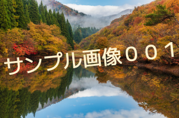
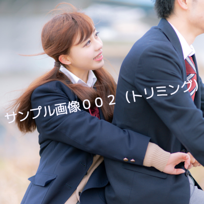
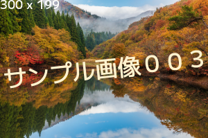
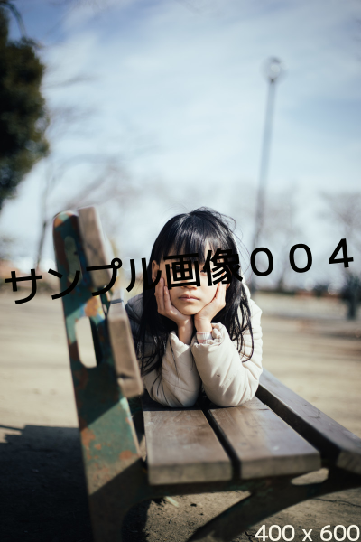
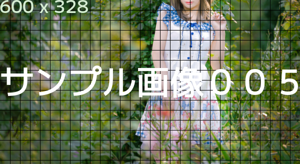

# サンプルイメージ生成用ライブラリ

## 概要
GDで各種サイズのサンプルイメージを簡単に生成するためのライブラリです。

## サンプルコード

### 1. 簡単な例
```php
use Shsk\Sample\Creator;

// 画像を読み込む
$creator = Creator::createFromImage('src/050AME0226_TP_V4.jpg');
// テキストを設定（フォントサイズは自動的に決定されるので設定をしない）
$creator->setText('サンプル画像００１', realpath('fonts/Mplus2-Medium.otf'), 6);
// テキスト設定前に処理を追加する
$creator->before(function ($controller) {
    // 指定した横幅にリサイズする
    return $controller->resize(['width' => 300]);
});
// 処理実行
$creator->execute();
// 画像形式を変換して保存する
$creator->save('results/sample001-simple/sample_001.png', true);
```

#### 結果



### 2. トリミング
```php
use Shsk\Sample\Creator;

use Shsk\Property\Size;
use Shsk\Property\Coordinate;

// 画像を読み込む
$creator = Creator::createFromImage('src/yukachi0I9A5356_TP_V4.jpg');
// テキストを設定（フォントサイズは自動的に決定されるので設定をしない）
$creator->setText('サンプル画像００３（トリミング）', realpath('fonts/Mplus2-Medium.otf'), 10);
// テキスト設定前に処理を追加する
$creator->before(function ($controller) {
    // 指定した横幅にリサイズする
    $resized = $controller->resize(['width' => 400]);
    // 切り取るサイズを設定
    $trimSize = new Size(400, 400);
    // 切り取る左上のXY座標を設定
    $trimPos = new Coordinate(0, 0);
    // トリミングする
    return $resized->trimming($trimSize, $trimPos);
});
// 処理実行
$creator->execute();
// 画像形式を変換して保存する
$creator->save('results/sample002-trimming/sample_002.png', true);
```

### 結果




### 3. 縦横のサイズを表すテキストを追加
```php
use Shsk\Sample\Creator;

// 画像を読み込む
$creator = Creator::createFromImage('src/050AME0226_TP_V4.jpg');
// テキストを設定（フォントサイズは自動的に決定されるので設定をしない）
$creator->setText('サンプル画像００４', realpath('fonts/Mplus2-Medium.otf'), 6);
// 画像サイズを表す{width} x {height}のテキストを設定する
$creator->setImageSizeText();

// テキスト設定前に処理を追加する
$creator->before(function ($controller) {
    // 指定した横幅にリサイズする
    return $controller->resize(['width' => 300]);
});
// 処理実行
$creator->execute();
// 画像形式を変換して保存する
$creator->save('results/sample003-size_text/sample_003.png', true);
```
### 結果



### 4. サイズ表示位置の変更

```php
use Shsk\Sample\Creator;


// 画像を読み込む
$creator = Creator::createFromImage('src/ANJ3P2A3559_TP_V4.jpg');
// テキストを設定（フォントサイズは自動的に決定されるので設定をしない）
$creator->setText('サンプル画像００４', realpath('fonts/Mplus2-Medium.otf'), 6);
// 画像サイズを表す{width} x {height}のテキストを設定する
$creator->setImageSizeText();
// 画像サイズを表すテキストの表示位置を設定
$creator->setImageSizeTextPosition('rightBottom');

// テキスト設定前に処理を追加する
$creator->before(function ($controller) {
    // 指定した横幅にリサイズする
    return $controller->resize(['width' => 400]);
});
// 処理実行
$creator->execute();
// 画像形式を変換して保存する
$creator->save('results/sample004-size_text/sample_004.png', true);
```

### 結果


### 5. グリッドを描画する

```php
use Shsk\Sample\Creator;
use Shsk\Image\Color as Color;
// 画像を読み込む
$creator = Creator::createFromImage('src/ishinageport_TP_V4.jpg');
// テキストを設定（フォントサイズは自動的に決定されるので設定をしない）
$creator->setText('サンプル画像００５', realpath('fonts/Mplus2-Medium.otf'), 0);
// 画像サイズを表す{width} x {height}のテキストを設定する
$creator->setImageSizeText();

// テキスト設定前に処理を追加する
$creator->before(function ($controller) {
    // 指定した横幅にリサイズする
    $resized = $controller->resize(['width' => 600]);

    // 方眼を書き込む
    $resized->drawGrid(20, new Color(0, 0, 0));

    return $resized;
});
// 処理実行
$creator->execute();
// 画像形式を変換して保存する
$creator->save('results/sample005-draw_grid/sample_005.png', true);
```

### 結果
